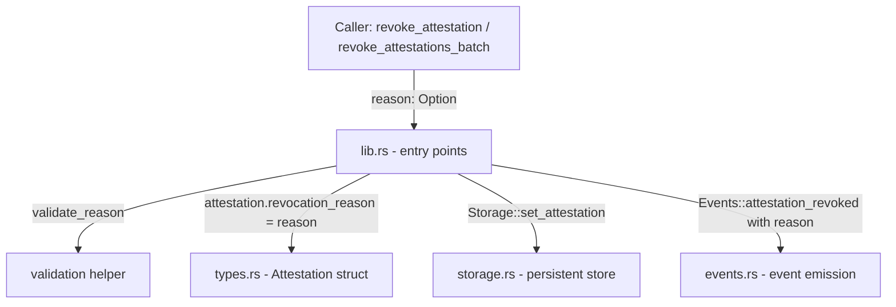

# Design Document: Revocation Reason

## Overview

This feature adds an optional `revocation_reason` field to the `Attestation` struct, allowing issuers to attach a human-readable reason code when revoking an attestation. The reason is bounded to 128 characters to keep on-chain storage costs predictable, is stored on the attestation record, and is included in the `AttestationRevoked` event so off-chain indexers can capture the full revocation context without additional queries.

The change is fully backward-compatible: callers that omit a reason pass `None` and the contract behaves exactly as before.

## Architecture

The feature touches four layers of the contract, each with a minimal, focused change:



No new storage keys are required. The `revocation_reason` field is stored inline on the `Attestation` value, which is already persisted under `StorageKey::Attestation(id)`.

## Components and Interfaces

### `src/types.rs` — `Attestation` struct

Add one field:

```rust
pub revocation_reason: Option<String>,
```

All existing construction sites (`create_attestation`, `import_attestation`, `bridge_attestation`, `cosign_attestation`) must initialise this field to `None`.

Add a new error variant:

```rust
ReasonTooLong = 21,
```

### `src/lib.rs` — entry points

**`revoke_attestation`** gains a new parameter:

```rust
pub fn revoke_attestation(
    env: Env,
    issuer: Address,
    attestation_id: String,
    reason: Option<String>,
) -> Result<(), Error>
```

**`revoke_attestations_batch`** gains a new parameter:

```rust
pub fn revoke_attestations_batch(
    env: Env,
    issuer: Address,
    attestation_ids: Vec<String>,
    reason: Option<String>,
) -> Result<u32, Error>
```

A shared validation helper is added:

```rust
fn validate_reason(reason: &Option<String>) -> Result<(), Error> {
    if let Some(r) = reason {
        if r.len() > 128 {
            return Err(Error::ReasonTooLong);
        }
    }
    Ok(())
}
```

For `revoke_attestations_batch`, `validate_reason` is called once before the loop so that no attestations are revoked if the reason is invalid (atomic all-or-nothing behaviour).

### `src/events.rs` — `Events::attestation_revoked`

The function signature changes to include the reason:

```rust
pub fn attestation_revoked(
    env: &Env,
    attestation_id: &String,
    issuer: &Address,
    reason: &Option<String>,
)
```

The published event data becomes a tuple `(attestation_id, reason)` instead of just `attestation_id`, keeping the topic unchanged (`symbol_short!("revoked"), issuer`).

### `src/test.rs` — unit tests

Four new tests are required (see Requirement 5):

| Test name | Scenario |
|---|---|
| `test_revoke_with_reason_stores_reason` | Non-`None` reason is persisted |
| `test_revoke_without_reason_stores_none` | `None` reason leaves field `None` |
| `test_revoke_reason_too_long_rejected` | >128 chars returns `ReasonTooLong` |
| `test_revoke_reason_exactly_128_chars_accepted` | Exactly 128 chars succeeds |

## Data Models

### Updated `Attestation` struct

```rust
#[contracttype]
#[derive(Clone, Debug, Eq, PartialEq)]
pub struct Attestation {
    pub id: String,
    pub issuer: Address,
    pub subject: Address,
    pub claim_type: String,
    pub timestamp: u64,
    pub expiration: Option<u64>,
    pub revoked: bool,
    pub metadata: Option<String>,
    pub valid_from: Option<u64>,
    pub imported: bool,
    pub bridged: bool,
    pub source_chain: Option<String>,
    pub source_tx: Option<String>,
    pub tags: Option<Vec<String>>,
    pub revocation_reason: Option<String>,  // NEW
}
```

The field is appended at the end to minimise XDR encoding disruption for existing tooling that reads the struct positionally. Because Soroban `#[contracttype]` structs are encoded by field name in XDR, existing stored attestations that lack this field will deserialise with `revocation_reason = None` automatically — no migration is needed.

### Updated `Error` enum

```rust
ReasonTooLong = 21,
```

### Updated `AttestationRevoked` event payload

| Position | Before | After |
|---|---|---|
| Topics[0] | `symbol_short!("revoked")` | `symbol_short!("revoked")` (unchanged) |
| Topics[1] | `issuer: Address` | `issuer: Address` (unchanged) |
| Data | `attestation_id: String` | `(attestation_id: String, reason: Option<String>)` |

